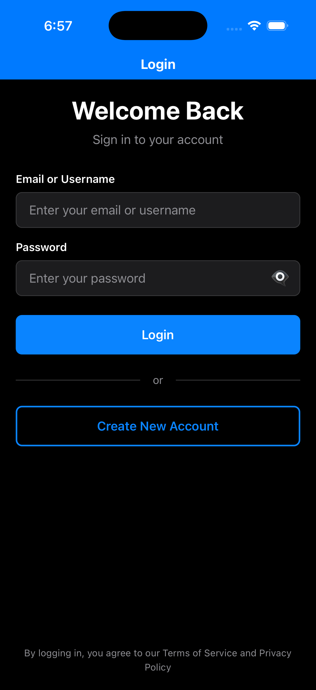
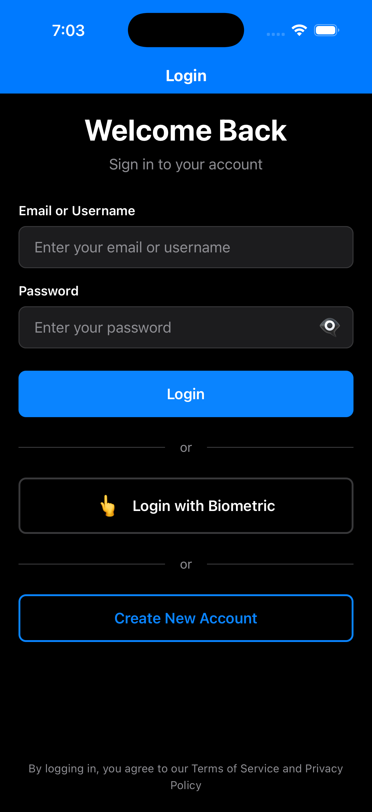
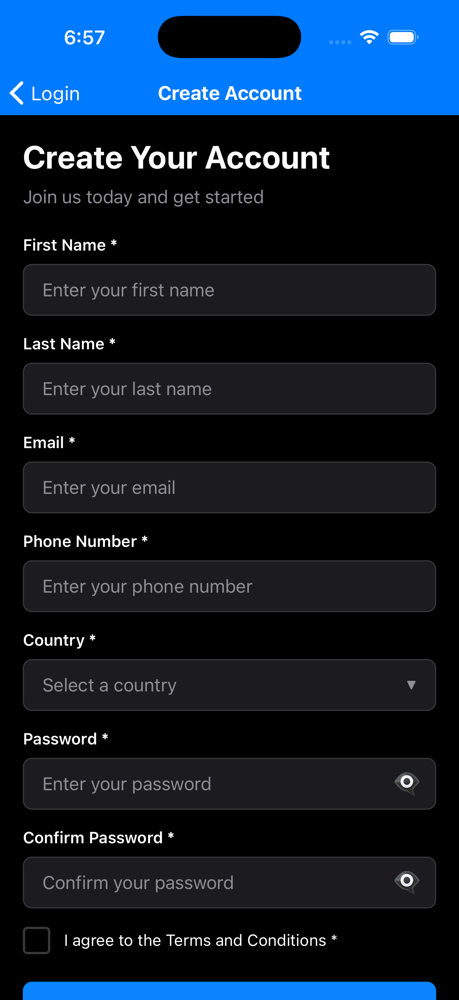
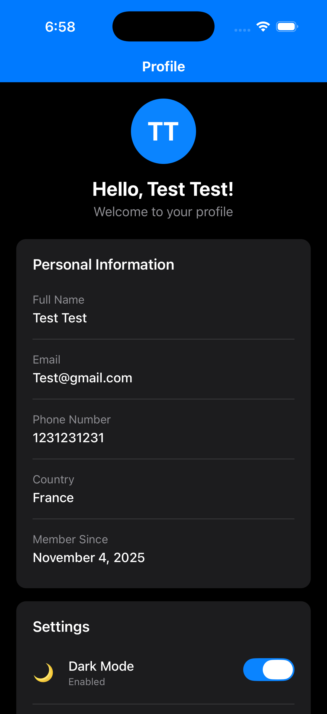
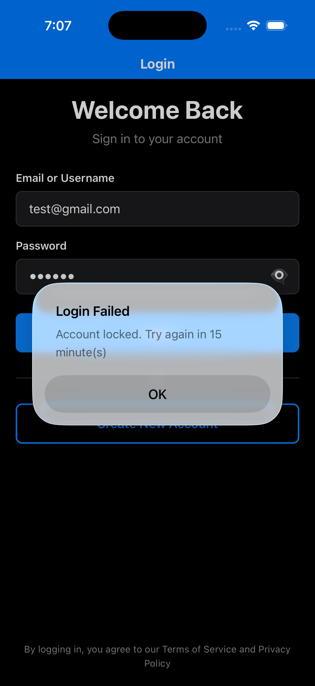

# Account Setup App

A React Native CLI application that replicates an account setup experience with secure authentication, form validation, and persistent storage.

## Features

- ✅ **User Registration** - Complete registration form with validation
- ✅ **User Login** - Secure login with lockout mechanism after 5 failed attempts
- ✅ **Biometric Authentication** - Face ID / Touch ID / Fingerprint support for quick login
- ✅ **Dark Mode** - Full dark mode support with manual toggle and system preference detection
- ✅ **Form Validation** - Comprehensive validation for all input fields
- ✅ **Password Strength Indicator** - Real-time password strength feedback
- ✅ **Secure Credential Storage** - Uses Keychain (iOS) / Keystore (Android) for secure storage
- ✅ **Session Persistence** - Maintains user session across app restarts
- ✅ **Draft Persistence** - Auto-saves registration form progress
- ✅ **Accessibility** - Screen reader support, proper labels, and ARIA attributes
- ✅ **TypeScript** - Fully typed for better development experience
- ✅ **Unit Tests** - Comprehensive test coverage for validation and auth logic
- ✅ **Modern UI** - Clean and intuitive user interface with theme support

## Screenshots

<div style="display: flex; flex-wrap: wrap; gap: 20px; justify-content: center;">

### Login Screen


The login screen features:
- Email/Username input field
- Password input with show/hide toggle
- Primary login button
- Biometric authentication option (Face ID/Touch ID/Fingerprint)
- Create New Account button for registration
- Terms of Service and Privacy Policy acceptance message

### Login with Biometric


Biometric authentication support:
- Quick login option using Face ID, Touch ID, or Fingerprint
- Seamless authentication experience
- Fallback to password login if biometric fails

### Registration Screen


Comprehensive registration form with:
- First Name and Last Name fields
- Email input with validation
- Phone Number field
- Country selector dropdown
- Password fields with strength indicator
- Password visibility toggle
- Confirm Password field
- Terms and Conditions checkbox
- Form validation with real-time feedback

### Profile Screen


User profile displaying:
- User avatar with initials
- Personalized greeting
- Full Name
- Email address
- Phone Number
- Country
- Member Since date
- Dark Mode toggle in Settings section

### Account Lockout


Security feature in action:
- Account lockout after 5 failed login attempts
- 15-minute lockout period
- Clear error messaging
- Protection against brute-force attacks

</div>

## Requirements

- Node.js >= 18.x
- npm or yarn
- React Native development environment
  - For iOS: Xcode 14+, CocoaPods
  - For Android: Android Studio, JDK 17+

## Setup Instructions

### 1. Install Dependencies

```bash
npm install
```

### 2. Install iOS Pods (iOS only)

```bash
cd ios && pod install && cd ..
```

### 3. Start Metro Bundler

```bash
npm start
```

### 4. Run the App

**For iOS:**
```bash
npm run ios
```

**For Android:**
```bash
npm run android
```

## Available Scripts

- `npm start` - Start Metro bundler
- `npm run ios` - Run on iOS simulator
- `npm run android` - Run on Android emulator/device
- `npm test` - Run unit tests
- `npm run test:watch` - Run tests in watch mode
- `npm run test:coverage` - Run tests with coverage report
- `npm run lint` - Run ESLint
- `npm run lint:fix` - Run ESLint and auto-fix issues
- `npm run format` - Format code with Prettier
- `npm run format:check` - Check code formatting
- `npm run type-check` - Run TypeScript type checking

## Architecture

### Project Structure

```
src/
├── components/          # Reusable UI components
│   ├── CustomButton.tsx
│   ├── CustomInput.tsx
│   └── CustomPicker.tsx
├── screens/            # Screen components
│   ├── LoginScreen.tsx
│   ├── RegistrationScreen.tsx
│   └── HomeScreen.tsx
├── navigation/         # Navigation configuration
│   └── AppNavigator.tsx
├── services/          # Business logic services
│   ├── authService.ts
│   └── storageService.ts
├── hooks/             # Custom React hooks
│   └── useAuth.tsx
├── utils/             # Utility functions
│   └── validation.ts
├── types/             # TypeScript type definitions
│   └── index.ts
└── data/              # Static data files
    └── countries.json
```

### State Management

- **Authentication State**: Managed via React Context API (`useAuth` hook)
- **Form State**: Managed via `react-hook-form` for optimal performance
- **Persistent State**: AsyncStorage for non-sensitive data, Keychain/Keystore for credentials

### Navigation

- **React Navigation** - Stack navigation with conditional routing based on auth state
- **Auth Flow** - Automatic navigation between login/registration and home screens

## Validation Rules

### Registration Form

1. **First Name**
   - Required
   - 2-50 characters
   - Letters only

2. **Last Name**
   - Required
   - 2-50 characters
   - Letters only

3. **Email**
   - Required
   - Valid email format
   - RFC 5322 compliant

4. **Phone Number**
   - Required
   - 10-15 digits
   - International format supported

5. **Country**
   - Required
   - Select from predefined list

6. **Password**
   - Required
   - Minimum 8 characters
   - Must contain:
     - At least one uppercase letter
     - At least one lowercase letter
     - At least one number
     - At least one special character (@$!%*?&)

7. **Confirm Password**
   - Required
   - Must match password

8. **Terms and Conditions**
   - Required
   - Must be checked

### Login Form

1. **Email/Username**
   - Required
   - Minimum 3 characters

2. **Password**
   - Required
   - Minimum 6 characters

## Security Approach

### Credential Storage

- **Keychain (iOS)** - Secure storage using iOS Keychain Services
- **Keystore (Android)** - Secure storage using Android Keystore System
- **No Plaintext** - Passwords are never stored in plaintext
- **Library Used**: `react-native-keychain` v10.0.0

### Session Management

- Session state persisted using AsyncStorage
- Automatic session restoration on app restart
- Secure logout clears all sensitive data
- Failed login attempt tracking

### Security Features

1. **Account Lockout** - 5 failed login attempts trigger 15-minute lockout
2. **Biometric Protection** - Optional biometric authentication for quick, secure login
3. **Draft Exclusion** - Passwords never saved in draft registration data
4. **Local Only** - No network calls, all data stored locally
5. **Secure by Default** - Uses native secure storage APIs with biometric protection

## Accessibility Features

- ✅ Proper accessibility labels and hints
- ✅ Screen reader support (TalkBack/VoiceOver)
- ✅ Keyboard navigation support
- ✅ Focus order management
- ✅ Sufficient color contrast (WCAG AA compliant)
- ✅ Touch target sizes ≥ 44x44 points
- ✅ Alternative text for interactive elements

## Testing

### Test Coverage

- ✅ Validation logic (email, phone, password)
- ✅ Authentication service (register, login, logout)
- ✅ Storage service (draft persistence)
- ✅ Password strength calculation

### Running Tests

```bash
# Run all tests
npm test

# Run with coverage
npm run test:coverage

# Watch mode
npm run test:watch
```

## Trade-offs and Decisions

### 1. Local-Only vs API Integration

**Decision**: Implemented fully local storage
**Rationale**: Per requirements, no network calls. Keeps data private and works offline.
**Trade-off**: Not suitable for production without backend integration.

### 2. React Hook Form vs Formik

**Decision**: Used React Hook Form
**Rationale**: Better performance, smaller bundle size, built-in TypeScript support.
**Trade-off**: Less familiar to some developers.

### 3. Context API vs Redux

**Decision**: Used Context API for auth state
**Rationale**: Simpler for this scope, no additional dependencies.
**Trade-off**: May need Redux for larger apps with complex state.

### 4. Navigation Library

**Decision**: React Navigation (Stack Navigator)
**Rationale**: Industry standard, excellent documentation, TypeScript support.
**Trade-off**: Slightly larger bundle compared to alternatives.

### 5. Password Storage

**Decision**: Using react-native-keychain
**Rationale**: Leverages native secure storage, cross-platform.
**Trade-off**: In production, would hash passwords before storage.

### 6. Draft Persistence Strategy

**Decision**: Auto-save on form changes, exclude passwords
**Rationale**: Better UX, security-conscious.
**Trade-off**: Slightly more AsyncStorage operations.

## Known Limitations

1. **No Backend Integration** - All data stored locally (per requirements)
2. **Single Device** - User data not synced across devices
3. **No Password Recovery** - Would require backend implementation
4. **No Email Verification** - Simulated registration without actual email verification
5. **Limited Biometric Support** - Optional feature not fully implemented

## Implemented Enhancements

- ✅ **Biometric authentication** (Face ID / Touch ID / Fingerprint) - Fully implemented with toggle in settings
- ✅ **Dark mode support** - Complete dark theme with manual toggle and system preference detection

## Future Enhancements

- [ ] Multi-language support (i18n)
- [ ] Profile editing functionality
- [ ] Password change feature
- [ ] Account deletion
- [ ] Export user data
- [ ] Analytics integration
- [ ] Automatic dark mode based on time of day

## Browser/Platform Compatibility

- ✅ iOS 13.0+
- ✅ Android 7.0+ (API 24+)

## Dependencies

### Core Dependencies

- `react`: ^19.1.1
- `react-native`: ^0.82.1
- `@react-navigation/native`: ^7.1.19
- `@react-navigation/stack`: ^7.6.2
- `react-hook-form`: ^7.66.0
- `yup`: ^1.7.1
- `react-native-keychain`: ^10.0.0
- `@react-native-async-storage/async-storage`: ^2.2.0

### Development Dependencies

- `typescript`: ^5.8.3
- `jest`: ^29.6.3
- `@testing-library/react-native`: ^13.3.3
- `eslint`: ^8.19.0
- `prettier`: ^2.8.8

## License

This project is created as a test assignment and is for evaluation purposes only.

## Contact

For questions or feedback, please contact the development team.
